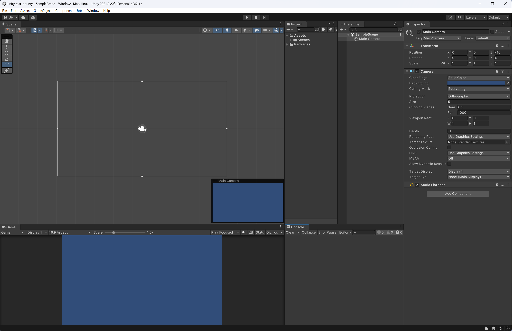

### Unity Custom Editor Layout
This is the custom layout I use for the Unity Editor. After trying several different layouts, I found that this one worked
best for my desktop and laptop setup.

To use, click the layout drop-down in the top right corner of the Unity Editor and select "Load Layout from File..." and select the "unity-layout-jhh-default.wlt" file.

Try it out, and [let me know what you think!](https://twitter.com/justinhhorner). If you have a recommendation to improve the layout, let me know.

### Preview

